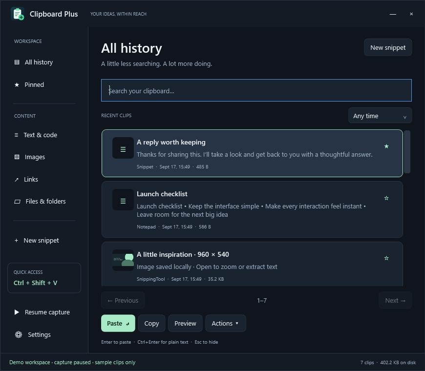
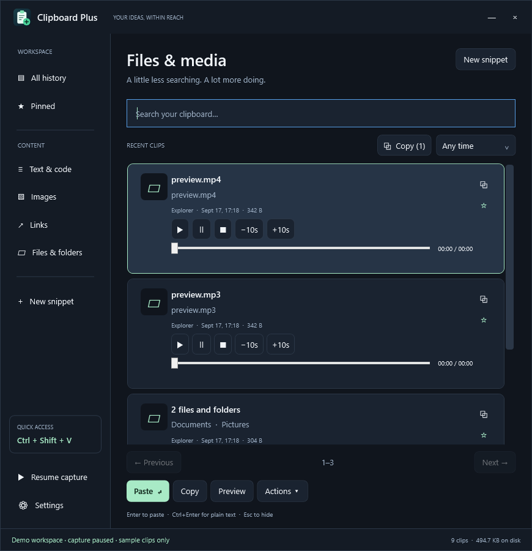

# Clipboard Plus

**A fast, private clipboard workspace for Windows.** Keep text, images, links, and file references within reach—with searchable history, image previews, media playback, and a shortcut you choose.

[Download the latest Windows release](https://github.com/kosherplay-betatester/Clip-Board-Plus/releases/latest) · [Report a bug](https://github.com/kosherplay-betatester/Clip-Board-Plus/issues) · [Changelog](CHANGELOG.md)



## Your clipboard can do more

| When you’re… | Clipboard Plus helps you… |
| --- | --- |
| Writing emails or answering customers | Pin reusable replies as named snippets and find them by name. |
| Researching across tabs | Keep copied quotes and links together, search your history, and combine selected text into notes. |
| Filling several fields | Queue copied items, then use the explicit **Paste next queued** button. |
| Moving between apps | Paste rich content normally, or use Ctrl+Enter for clean plain text. |
| Working with screenshots | Click the exact image to enlarge, zoom, pan, or view full screen; extract text with on-device OCR. |
| Checking an audio or video file | Preview from its original source with playback controls, seeking, and 10-second skips. |
| Organizing large files and folders | Recall whole selections by their paths, without duplicating the source files in clipboard storage. |
| Using the same details every day | Pin addresses, instructions, links, and snippets so they survive ordinary history cleanup. |

**Choose your shortcut. Keep more history. Find what you copied. Get back to work.**

## Feature highlights

- **Readable rich-text history:** HTML/RTF-only copies gain searchable text previews and plain-text paste. Existing blank previews repair locally in small batches, preserving the original rich content.
- **Stable choices:** incoming copies show a **New clips** button instead of moving items underneath your pointer. Reopening history or refreshing shows the latest captures.
- **Guarded repeat pasting:** double-click acts on the clicked item, keeps its destination snapshot, and checks focus and clipboard changes before sending paste.
- **Copy one or many:** each row has a copy icon; select several clips and use **Copy (count)** beside Recent clips, or Ctrl+C while the list is focused. Combine text, file references and image attachments in one clipboard operation.
- **Captions when you need them:** Actions → Copy selected text only copies the text from a mixed selection separately. Messaging apps decide whether to accept text, attachments, or both; the app never sends messages for you.
- **Record shortcuts:** click a button and press one key or a combination of up to three keys. Supports F12, ScrLk, Ctrl+D, Ctrl+Shift+V, and Win+V.
- **Correct image previews:** each thumbnail opens the image you clicked, including when multiple items are selected or another preview is open.
- **Media on the clip:** play/pause/stop, a time track, and 10-second skips on audio and video rows. Audio plays inline; video opens a simple player with full screen.
- **Pick excluded apps:** select an open app or browse to its program, with removable entries instead of a semicolon-separated text field.
- **Windows history controls:** Automatic, Always on, Always off, or Leave unchanged, with policy restriction detection.
- **Friendly installer:** per-user setup, desktop/startup choices, Start menu entry, upgrade support, and Windows Apps uninstall.
- **Manual updates:** Settings → Check for updates, or Open releases. No scheduled checks, automatic downloads or automatic installs.
- **New icon:** a clipboard with a mint plus badge, rendered at seven sizes for Windows and the tray.


A native Windows clipboard history app built with .NET 10, WPF, Windows clipboard APIs, and SQLite. Copy text, rich text, images, links, files, or folders; find them quickly and paste them back into your work.

## Download and get started

### [⬇ Download Clipboard Plus for Windows](https://github.com/kosherplay-betatester/Clip-Board-Plus/releases/latest)

[Browse every release and its notes](https://github.com/kosherplay-betatester/Clip-Board-Plus/releases). Requires Windows 10 version 2004 or later / Windows 11, x64.

Download **ClipboardPlus-Setup-1.1.1-win-x64.exe** from GitHub Releases and follow the setup wizard. It installs for your Windows account without administrator privileges and offers a desktop shortcut, optional startup at sign-in, and launch on completion. Updates reuse the same installation; your separate clipboard history is preserved. Uninstall through Windows Apps.

**1.1.1 is a reliability update.** It repairs existing blank text previews, recovers text from HTML/RTF-only copies, keeps rows stable while you choose a clip, and separates queued paste from normal Paste/Enter. Use Settings → Check for updates or download the new installer. Setup asks before closing a running app and keeps it running if you decline. Silent setup will not close a running app automatically.

Prefer portable? Extract **ClipboardPlus-win-x64.zip** into a permanent folder and run **ClipboardPlus.exe**. Both downloads include .NET and work offline after download.

The default shortcut is **Ctrl+Shift+V**. Closing the panel keeps capture running in the notification area. Use the tray menu to quit. Startup at sign-in is optional in Settings. It initializes silently in the tray. Keep the extracted folder in a permanent location before enabling startup; moving it later requires saving the startup setting again.

**Stay up to date on your terms:** open Settings → **Check for updates**, then choose whether to visit the releases page and download an installer. The app never installs updates automatically.

## Built to stay out of your way

History lives on disk, with a bounded memory cache and a virtualized list that loads small pages as you browse. Set your own item count, retention period, disk budget, and cache budget; Settings shows current memory use and a suggested cache size for your PC. Files and folders remain references to their original locations, and media decoders are created only when needed and released when previews close.

Everything stays local unless you explicitly open an online source or check GitHub for updates. There are no accounts, subscriptions, telemetry, or background cloud sync. Dark and light themes, a tray menu, and optional quiet startup keep the app close at hand.

## Everyday use

- Copy normally. Open the panel using its shortcut while your destination app is active.
- Type to search words, filename components, snippet names, or source app names. Search supports word prefixes up to 24 characters and whole longer words, with up to 16 search terms combined.
- Select a clip and press **Enter** to paste. **Ctrl+Enter** pastes plain text. **Copy** places an item on the clipboard without switching apps.
- **Ctrl+F** focuses search, **Down** moves from search into history, **Space** previews the selected item, and **Escape** hides the panel.
- Click an image thumbnail or choose **Preview** to zoom, pan, enter full screen, or extract text on-device. **F11** toggles preview full screen.
- Use **Ctrl/Shift+click** to select multiple clips. Under **Actions**, queue them in list order or combine their text into lines. Use **Paste next queued** to consume the queue. Enter always pastes the selected clip.
- Pin items or create named, pinned snippets. Use Actions to trim text, change case, or copy file paths.
- Filters cover text, images, links, files/folders, pins, and dates. History is paged in groups of 80 and uses UI virtualization.



## Shortcuts and Windows history

Settings offers two modes:

1. **Recorded shortcut:** choose **Record shortcut**, press one key plus up to two modifiers (Ctrl, Alt, Shift, Win), and click **Use this shortcut**, then **Save settings**. Single keys such as F12 and ScrLk are supported. The assigned key is consumed while the app runs; choose a combination if you still need its ordinary action. Registration conflicts are reported without dropping the previous working shortcut.
2. **Win+V replacement:** choose the dedicated Win+V option or record Win+V. A dedicated keyboard-hook thread consumes this chord while Clipboard Plus runs. Switching back or exiting removes the hook.

**Windows clipboard history** has its own setting. Automatic requests off for Win+V and on for other shortcuts. Always on/off work independently of the chosen shortcut; Leave unchanged preserves Windows' current setting. Changes apply when saving Settings and on future launches after opting in. The app writes the current-user clipboard preference and reports if Windows has not applied it yet. It never removes administrator policies or Shutup10++ restrictions. If Windows says the setting is managed, undo that clipboard restriction in the tool that set it (or ask the administrator) before expecting Always on to work. No administrator privileges are requested. Disabling Windows history may clear Windows' unpinned history; Clipboard Plus history remains separate.

F12 and Windows-key chords use a low-level hook because the standard registration API reserves them. Secure shortcuts such as Ctrl+Alt+Delete cannot be reassigned. Hook-based shortcuts can conflict with other keyboard utilities; not every OS-reserved chord can be overridden.

Windows history collection and shortcut handling are separate. You can also open Windows' clipboard settings from this app to inspect Microsoft's storage/sync. Windows reserves its shortcuts; replacement behavior can be affected by other keyboard utilities, Windows updates, remote sessions, or elevated/secure desktops. Do not expect it on the sign-in or UAC secure desktop.

## Storage, memory, and privacy

- Defaults: **10,000 items**, **90 days** for unpinned entries, **512 MB disk budget**, **32 MB serialized-payload cache**, and **16 MB per saved clip**. All are configurable. The single-clip ceiling is 64 MB.
- History content, summaries, thumbnails, and file paths are encrypted with Windows DPAPI for the current user. Search stores keyed word hashes rather than readable text. Types, timestamps, sizes, counts, and pin state remain ordinary database metadata. This protects offline files from other accounts; it is not a defense against malicious programs running as the same user.
- No telemetry, accounts, cloud sync, or background URL fetching. Requested online previews contact their source. Clicking Check for updates contacts GitHub’s public latest-release API and sends the app version in its User-Agent; no clipboard contents are sent. Playback starts only after Play; webpage links open in the user's browser.
- Only two captures may be in flight. A busy stream or an oversized clip is skipped with a status message. No polling loop runs while idle.
- The cache is bounded and drops cached payloads under system memory pressure. Settings shows installed RAM, a suggested cache size, and current process usage. The cache budget is **not** a cap on total process memory; .NET, the UI, captured images, and media decoders have their own working memory.
- The disk budget includes live database pages and the search index. WAL transactions can temporarily use additional space. Oldest unpinned items are evicted first. Pins survive limits; if pins alone exhaust a budget, new unpinned captures may be rejected. Deletion reclaims pages and checkpoints the WAL.
- Existing files/folders are stored by reference, including grouped selections. No source file contents are imported into history. Historical file operations replay as **copy**, never as a stale cut/move. The destination app performs the transfer. A changed source means changed content; unavailable paths cannot be pasted.
- Screenshots and directly copied image pixels must be saved because they may have no source file. PNG payloads live in the protected database; the list uses small thumbnails. Previews decode to at most 2,400 pixels on the longest edge. External image loading is limited to 32 MB.
- When explicitly copying multiple items, image pixels are additionally exported as ordinary, unencrypted PNG files under `%LOCALAPPDATA%\ClipboardPlus\CopyExports` so other apps can attach them. This separate export folder is limited to 256 MB; exports older than seven days are removed during a later image batch copy. They are not deleted when a destination might still need them immediately. Original videos, audio, files and folders remain references. A combined selection is limited to 128 MB of image/text data. Single-image copy retains the normal bitmap/PNG clipboard formats without creating an export file.
- App exclusions use process names. Clipboard exclusion flags are respected. Pause capture immediately from the sidebar or tray. These measures cannot identify every password or secret automatically.

Data is stored in `%LOCALAPPDATA%\ClipboardPlus`. `settings.json` contains preferences; `history.db` and `search.key` belong together. Do not expect DPAPI-protected history to open under a different Windows account. There is no automatic file snapshot, cloud sync, or cross-account migration.

## Compatibility

Common Unicode text, HTML, RTF, bitmap images, HTTP(S) links, and existing file/folder selections are supported. Private application clipboard formats and virtual attachments without existing paths are not persisted. Image copy from many browsers provides a bitmap; applications offering only proprietary image formats may not be captured.

Media uses Windows' installed decoders. Local MP3 controls and H.264 MP4/WAV playback are tested; other codecs depend on the system. Protected streams and webpages containing embedded video are not direct media files. Unavailable media offers an external-open path. Windows OCR requires an installed supported language.

Automatic paste requires focus to return to the destination and may be blocked by Windows integrity-level restrictions. Clipboard Plus does not run elevated or bypass those restrictions: the copied clip remains available for manual Ctrl+V. Do not interpret successful input injection as proof an arbitrary destination accepted its clipboard format.

## Build and verify

Requires Windows 10 version 2004 or later (Windows 11 recommended) and the .NET 10 SDK. Building restores packages from nuget.org.

```powershell
dotnet build ClipboardPlus/ClipboardPlus.csproj -c Release
powershell -ExecutionPolicy Bypass -File scripts/Test.ps1
powershell -ExecutionPolicy Bypass -File scripts/Publish.ps1
```

Optional integration tests change the real clipboard and restore its previous data object; run them when you are not copying other material. Preview tests use generated synthetic fixtures and muted playback.

```powershell
powershell -ExecutionPolicy Bypass -File scripts/Test.ps1 -Clipboard -Media -Benchmark
```

The media fixture generator uses an existing `ffmpeg` executable; it is not a runtime app dependency. Test reports and release artifacts go under `artifacts/`. An additional `-InputTest` opens an interactive target: click **Start paste check** within two minutes. This real interaction gives Windows the foreground permission needed to test focus restoration and native paste; it should not be run unattended.

For a separate sample workspace and rendered visual checks:

```powershell
./ClipboardPlus/bin/Release/net10.0-windows10.0.19041.0/ClipboardPlus.exe --demo
./ClipboardPlus/bin/Release/net10.0-windows10.0.19041.0/ClipboardPlus.exe --demo --render-proof artifacts/visual
```

Demo capture starts paused and data lives separately under `%TEMP%\ClipboardPlus-Demo`. See [verification notes](docs/VERIFICATION.md) for measurements and remaining manual compatibility checks.

## License and contributing

Apache License 2.0; see [LICENSE](LICENSE). Existing history is kept under your Windows account when upgrading: quit Clipboard Plus, replace the extracted application files, then launch the new executable. Do not delete your local data folder.

See [CONTRIBUTING.md](CONTRIBUTING.md) for the development workflow, [SECURITY.md](SECURITY.md) for sensitive reports, and [third-party notices](THIRD_PARTY_NOTICES.md) for runtime dependencies. Please include Windows version, shortcut, clip type, and exact reproduction steps in bug reports; never attach private clipboard data.

## Building the installer

Install Inno Setup 6 on the build machine (it is not an app dependency), then:

```powershell
./scripts/Publish.ps1 -OutputRoot artifacts/releases/v1.1.0
./scripts/Build-Installer.ps1
```

The installer and portable ZIP are written to `artifacts/releases/v1.1.0/`. Installer artwork lives under `installer/assets/`; regenerate it with the built app's `--write-installer-art installer/assets` command. `Build-Installer.ps1 -InstallerTest` creates an isolated test product with a separate App ID, shortcuts, and startup registry value; this test installer is never distributed.
