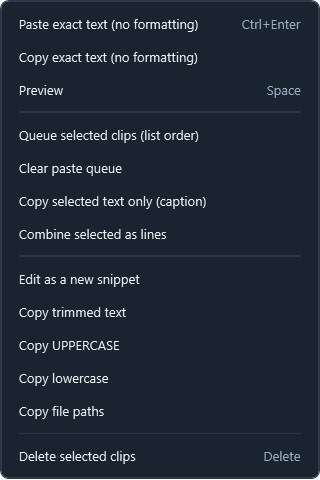
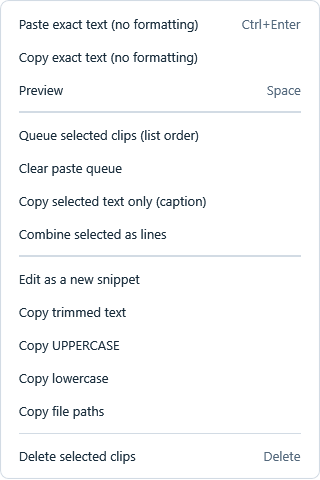
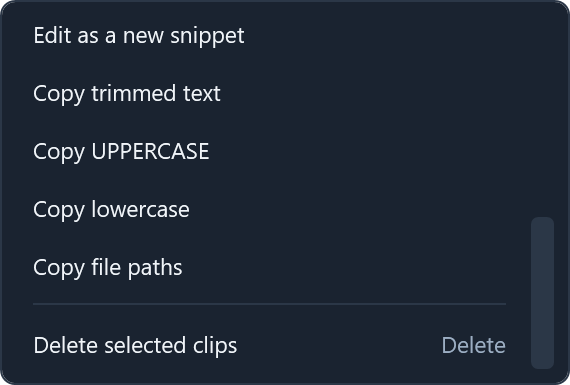

# Clipboard Plus 1.1.3 — Actions menu verification

The reported white vertical strip came from mixing the stock WPF ContextMenu frame, which includes an icon gutter, with custom full-width rows. The Actions popup now has a complete, coordinated frame and item template; ordinary text-box context menus are no longer affected by the Actions styles.

- Release build: zero warnings/errors. All 80 core regression checks passed.
- The app's `--demo --render-proof` path now opens the actual Actions popup and renders its visual tree in dark/light themes at 100%, 175% and 200% raster scale. Labels, shortcut alignment, backgrounds and separators were visually inspected.
- The same popup is constrained to 220 logical pixels in the render check. Its scrollable extent and successful scroll to the final action are checked; top and bottom views are rendered. Production size limits use the current monitor's work area converted by the window DPI, and the popup is anchored above the Actions button.
- These checks cover layout/rendering and scrolling. They are not new end-to-end clipboard/paste or multi-monitor input tests; previous compatibility limits remain in [the 1.1.2 record](VERIFICATION-1.1.2.md).

